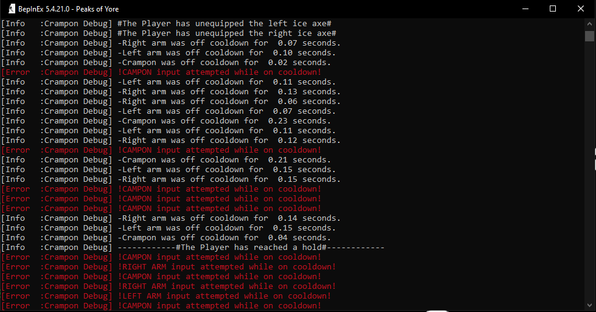

# Crampon Debug

> ⚠ **This mod has required dependencies and will not work without them.**

A lightweight debug mod that displays **timing information for crampons, hands, and pickaxes** to help identify correct and incorrect climbing inputs.

---

## Description

**Crampon Debug** provides both an on-screen UI and optional console output that tracks:

- Hand timing  
- Pickaxe timing  
- Crampon timing  
- Grounded state  
- Pickaxe swap state  
- Hold reach detection  

Incorrect timings are highlighted as **warnings** (yellow/red), while correct timings are shown in **neutral gray** for clarity.

### Timing Reference Values

- **Hand timing:** 100 BPM (≈ 0.6s)  
- **Pickaxe timing:** 85 BPM (≈ 0.7s)  
- **Crampon timing:** 60 BPM (≈ 1.0s)

---

## Preview

### UI Overlay

### Console Output

---

## Keybinds

- **Toggle UI:** `M` (default)  
  - Can be changed via **Mod Menu**

---

## Requirements

The following dependencies are **required**:

- **BepInEx**  
  https://github.com/BepInEx/BepInEx  
  *(Console must be enabled if `ConsoleOutput` is turned on)*

- **UILib**  
  https://github.com/Kaden5480/poy-ui-lib

- **Mod Menu**  
  https://github.com/Kaden5480/poy-mod-menu

Make sure all dependencies are installed before launching the game.

---

## Notes

- This is a **debug-focused mod**
- Bugs and edge cases are expected
- UI and timing behavior may change over time

---

## License

This project is licensed under the **GPL-3.0** License.
